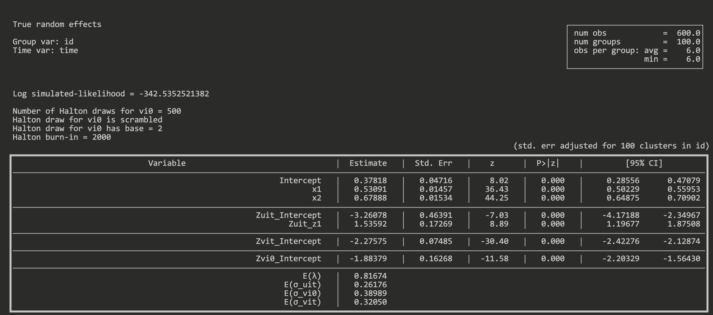
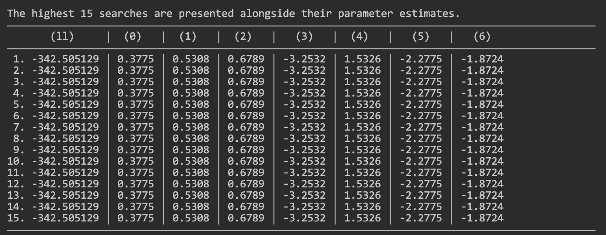

<a name="readme-top"></a>

<!-- project shields -->
<div align="center">
[](#)
[](https://www.python.org/downloads/)
[![Issues][issues-shield]][issues-url]
[![Forks][forks-shield]][forks-url]
[![Stars][stars-shield]][stars-url]

</div>

<!-- project header -->
<br>
<div align="center">
  <h1 align="center">sfacpp/pysfacpp</h1>
  <p align="center">
    An experiental implementation of the (heterogeneous) True Random Effects, and Generalized True Random Effects stochastic frontier models, built in C++ with both R and Python frontends. Use at your own risk.
    <br/>
    <a href="https://github.com/nhsengland/sfacpp/issues">Report a bug</a>
    <a href="https://github.com/nhsengland/sfacpp">Request a feature</a> 
  </p>
</div>

<!-- table of contents -->
<details>
  <summary>Table of Contents</summary>
  <ol>
    <li>
      <a href="#about-the-project">About the project</a>
      <ul>
        <li><a href="#status">Status</a></li>
        <li><a href="#known-issues">Known issues</a></li>
      </ul>
    </li>
    <li>
      <a href="#getting-started">Getting started</a>
      <ul>
        <li><a href="#system-requirements">System requirements</a></li>
        <li><a href="#dependencies">Dependencies</a></li>
        <li><a href="#installation">Installation</a></li>
      </ul>
    </li>
    <li>
      <a href="#usage">Usage</a>
      <ul>
        <li><a href="#performance">Performance</a></li>
        <li><a href="#example-in-python">Example in Python</a></li>
        <li><a href="#example-in-r">Example in R</a></li>
        <li><a href="#arguments">Arguments</a></li>
      </ul>
    </li>
    <li><a href="#roadmap">Roadmap</a></li>
    <li><a href="#contributing">Contributing</a></li>
    <li><a href="#license">License</a></li>
    <li><a href="#contact">Contact</a></li>
  </ol>
</details>

<!-- About the project -->

## About the project

This project aims to implement the heteroscedastic True Random (TRE) and Generalized True Random (GTRE) Stochastic Frontier models, with half-normal distributed inefficiency component(s). This is driven from a desire, firstly, to be able to estimate a GTRE with determinants, for which there does not appear to be an implementation (at time of the project starting), and secondly, to estimate both models using open-source languages in line with NHS England's Reproducible Analytical Pipelines (RAP) philosophy to use open-source tooling, and not rely on proprietary software. Furthermore, given the large panel internally used, there were performance concerns regarding time taken to estimate models with appropriate number of simulations, using existing packages available and software available to the author (Stata MP 2-core).

We have therefore, experimentally, implemented these models using C++, providing both an R and Python interface for ease of use.

Please see the limitations and caveats before using the package.

### Status

- [x] [R, Python] Initial implementation of log-likelihood, analytical gradient, and analytical Hessian for True Random Effects model (half-normal distributed inefficiency).
- [x] [R, Python] Marginal effects as defined by Wang 2002.
- [x] [R, Python] Logic to calculate bootstrapped confidence intervals for marginal effects.
- [x] [R, Python] Initial implementation of estimated inefficiency scores based on calculation from Colombi et al (2014), under skew-normality.
- [x] [R, Python] Initial implementation of estimated inefficiency scores per Jondrow et al (X) aka JLMS estimator.
- [x] [R, Python] Initial implementation of log-likelihood, analytical gradient, and analytical Hessian for Generalized True Random Effects (linked to TRE).
- [ ] [R, Python] Implementation of True Fixed Effects log-likelihood, analytical gradient, and analytical Hessian.
- [ ] [R, Python] Finalise bootstrapped confidence intervals for marginal effects.
- [ ] [R, Python] Investigate bias corrected bootstrap confidence intervals for marginal effects (mentioned in Wang 2002).
- [x] [Python] Develop Python interface.
- [x] [R, Python] Testing for JLMS efficiency estimator
- [x] [R, Python] Testing for inefficiency scores per Colombi et al (2014)
- [x] [R, Python] Add clustered standard errors for python interface
- [ ] [R] Integrate `sfacpp` object with `summary()` S3 method.
- [x] [R, Python] Ability to undertake Likelihood Ratio tests between models.
- [x] [R, Python] Performance improvements esp. re RAM usage.
- [x] [R, Python] 'searches' helper function/method to try to fit model `nrep` times with perturbed starting values, finding the model with the highest log-likehood score, to check convergence at a global maxima (although mindful of seperation issue when poor signal-to-noise ratio, see point 2 below). Alternatively can be used if the starting values generated are not useful.
- [x] [R, Python] Secondary optimization technique optional (two step: BFGS/LBFGS + Trusted Region)
- [ ] [R, Python] Implementation of the truncated-normal distributed inefficiency for TRE.

### Known bugs and issues

- [R] Calling `vcovHC` on model object will result in an error.
- [R, Python] The implementation of GTRE may currently struggle to seperate the time-invariant components - latent firm heterogeneity, persistent inefficiency, and the intercept term. See paper _"When, where and how to estimate persistent and transient efficiency in stochastic frontier panel data models"_ by Badunenko & Kumbhakar (2016). 
- [R, Python] Caution: If optimization is taking too long, try reducing the number of simulation aka Halton draws - although remain at least above $n^{\frac{2}{3}}$ to $n^{\frac{3}{4}}$ as Bernstein (2024) find benefits in reducing the mean squared error of technical efficiency estimates.
- [R, Python] Caution: Algorithm may often not converge. Try adding variables step by step, using starting values. Also consider rescaling variables. It can be very sensitive to starting values, so play with small changes.
- [R, Python] Warning: Algorithm may converge at a local, not global maxima. The starting values are a bit clapped (especially GTRE), and might not always be particularly helpful, nor robust. Any suggestions to improve them are much welcomed. We provide a 'searches' helper function/method, which runs a number of iterations based on random pertubations of the starting values.
- [R, Python] Warning: There is also an option to use a hybrid multi-step optimization strategy - first using BFGS/L-BFGS to get in an approximate area, followed by Trusted Region approach. This is useful when the pure trusted region optimization method fails to converge. Note that this is significantly slower at the moment, due to the large amount of log-likelihood & gradient calls to protect against non-finite parameters/gradient. See `optim_method` argument.

<p align="right">(<a href="#readme-top">back to top</a>)</p>

## Getting started

### System Requirements

- C++20 compiler (tested with clang, gcc)
- CMake

Tested on macOS and Linux (including via a Databricks cluster). Windows support is undetermined.

### Dependencies

#### R interface

#####  R Packages

The following R packages are used, and dependencies that are installed with the package.

- Rcpp (C++ integration with R) - enable use of C++ with R.
- RcppArmadillo (Linear algebra in C++).
- data.table (Alternative to data.frame) -
- BH (boost C++ headers) - used for various mathematical functions.
- R6 - used for an internal class
- RcppSpdlog (logging) - main logging framework (spdlog).

##### C++ Packages

The following C++ packages are used (via submodules)

- dlib - C++ library - note we cannot use `dlib` R package which wraps dlib 19.2 as this is too outdated for our C++ version (20).
- [thread-pool](https://github.com/bshoshany/thread-pool) (v5.0.0) - C++ library

#### Python interface

##### Python packages

- numpy
- pandas
- patsy

##### C++ Packages

- Dependencies are managed by `python/CMakeLists.txt`, no external libraries are needed, although we do link to Blas and LAPACK (which will be built from source if not on the system).

<p align="right">(<a href="#readme-top">back to top</a>)</p>

### Installation 

Clone the package, alongside the submodules using `git clone <url> --recursive`

<p align="right">(<a href="#readme-top">back to top</a>)</p>

## Usage

### Performance

We support multi-threading, enabled through `thread-pool`, used to calculate the gradient and/or Hessian per firm, which lends itself well to parallel processing. We also use thread-local storage (TLS) to provide a scratch space for calculation to avoid malloc traffic and minimise lock contention. This pre-allocates memory based on the maximum number of observations per firm (per thread) to avoid resizing for unbalanced panels, however does mean if there is an abnormally large panel, this may consume much more memory than necessary. Adjusting the number of threads will reset the all TLS, and reallocate (as all threads are destroyed). The TLS persists for the life-time of the thread.

We implement a minimal-copy philosophy in the C++ code (which relies on a column-major contiguous matrix (`asfortranarray`) in Python), although if you wish, an initial copy from Python to C++ can be undertaken.

### Example in Python

```python
from pysfacpp.model import PySfaCpp, PySfaCppResult
import pandas as pd

# assuming a Pandas with y, x1, x2, x3, z1, z2 (where y & x's are in natural logs)
# and rows can be identified by id_col, and time_col
df: pd.DataFrame = pd.DataFrame(...)
# True Random Effects model
mdl: PySfaCpp = PySfaCpp(
  form_x="y ~ x1 + x2",
  form_zuit="~ z1",
  id_col="id_col",
  time_col="time_col",
  model="tre",
  data=df,
  # whether or not to calculate efficiency scores (default = False)
  calculate_efficiency_scores=True,
  # whether or not to calculate marginal effects (default = False)
  estimate_marg_eff=True,
  # clustered standard errors in 'id_col' (default = True)
  clustered_se=True
)
# fit the model - automatically prints the regression output
mdl_res: PySfaCppResult = mdl.fit()
# print the regression output again
print(mdl_res)
# if estimated efficiencies, get them as a pandas dataframe
effs: pd.DataFrame = mdl_res.efficiencies
# if estimated marginal effects, get them as a pandas dataframe
marg_effects: pd.DataFrame = mdl_res.marginal_effects
# model output table (estimates, std err, pvals, CIs etc)
mdl_output: pd.DataFrame = mdl_res.model_summary

# estimate a gtre model
gtre: PySfaCpp = PySfaCpp(
  form_x="y ~ x1 + x2",
  form_zuit="~ z1",
  form_zvit="~ w1",
  form_zui0="~ z2",
  form_zvi0="~ w2",
  id_col="id_col",
  time_col="time_col",
  data=df,
  model="gtre",
  calculate_efficiency_scores=True,
  estimate_marg_eff=True,
  clustered_se=True
)
# fit the model
gtre_res: PySfaCppResult = gtre.fit()
# searches can be done by call the searches method
searches: dict = gtre.searches(
  # how many searches
  nsearches=1000,
  # how wide for the frontier components
  slength_frontier=2.0,
  # how wide for the sigma terms
  slength_sigmas=0.8,
  # how many attempts to find some valid starting values before give up (per search)
  max_attempt_start_vals=50
)
```

<div align="center">
<figure>

<figcaption>Example regression output</figcaption>
</figure>
</div>

<div align="center">
<figure>

<figcaption>Example searches output</figcaption>
</figure>
</div>

### Example in R

```R
library(data.table)
library(sfacpp)

dt <- fread(...)

# TRE model
model1 <- sfacpp::sfacpp(
  form_x = y ~ x1 + x2,
  form_zuit = ~ z1,
  data = dt,
  id_col = "id_col",
  time_col = "time_col",
  model = "tre",
  clustered_se = FALSE
)
# supports the sandwich vcovCL if preferred
lmtest::coeftest(model1, sandwich::vcovCL(model1, cluster = ~ id_col))
# GTRE model
model2 <- sfacpp::sfacpp(
  form_x = y ~ x1 + x2,
  form_zuit = ~ z1,
  form_zvit = ~ w1,
  form_zvi0 = ~ w2,
  form_zui0 = ~ z2,
  data = dt,
  id_col = "id_col",
  time_col = "time_col",
  model = "gtre"
)
# run some searches
searches <- sfacpp::sfacpp_searches(
  form_x = y ~ x1 + x2,
  form_zuit = ~ z1,
  form_zvit = ~ w1,
  form_zvi0 = ~ w2,
  form_zui0 = ~ z2,
  data = dt,
  id_col = "id_col",
  time_col = "time_col",
  model = "gtre",
  # how many searches
  nsearches = 1000,
  # how wide for the frontier components
  slength_frontier = 2.0,
  # how wide for the sigma terms
  slength_sigmas = 0.8,
  # how many attempts to find some valid starting values before give up (per search)
  max_attempt_start_vals = 50
)

```

### Arguments

Both the R (`sfacpp::sfacpp`) and Python (`pysfacpp.model.PySfaCpp`) interfaces are almost identical

- `form_x` - (R: `formula` object, Python: `str`), containing the two sided formula expression for the production function, where the output (left-hand side), and inputs (right-hand side) are expressed in natural logarithms.
- `data` - (R: `data.table`, Python: `pd.DataFrame`) containing the model dataset.
- `id_col` - a string of the name of the column identifying firms/individuals, which is present in `data`.
- `time_col` - a string of the name of the column identifying time, which is present in `data`.
- `form_zmuit` - (R: `formula` object, Python: `str`) a one-sided formula, containing the variables determining the truncation point. Only relevant when `dist` is `tnorm`, that is, a truncated-normal distribution is used.
- `form_zuit` - (R: `formula` object, Python: `str`) a one-sided formula, containing the variables determining time-varying inefficiency. Relevant when `dist` is one of `hnorm` or `tnorm`, and when `model` is `tfe`, `tre`, `gtre` or `cross`.
- `form_zui0` - (R: `formula` object, Python: `str`) a one-sided formula, containing the variables determining time-invariant inefficiency. Only relevant when `model` is `gtre`.
- `form_zvit` - (R: `formula` object, Python: `str`) a one-sided formula, containing the variables determining (time-varying) stochastic noise. Relevant when `model` is `tfe`, `tre`, `gtre`, `cross`.
- `form_zvi0` - (R: `formula` object, Python: `str`) a one-sided formula, containing the variables determining (time-invariant) firm effect.Relevant when `model` is `tre` or `gtre`.
- `start` - (R: `vec`, Python: `list|np.ndarray`) an optional vector of starting values for the maximum likelihood optimization process. If not equal to the number of terms to estimate, this is either padded or truncated. If not specified, default starting values are calculated.
- `prod` - an integer, either `1` or `-1`, on whether a production or cost function respectively. Note cost function not fully supported.
- `dist` - a string denoting the distribution to use for the inefficiency term. Either `hnorm` for half-normal distribution, or `tnorm` for truncated-normal distribution. __only `hnorm` currently supported__.
- `model` - a string denoting the model to use. Either `tfe` for the True Fixed Effects (proposed by Greene, 2005), `tre` for the True Random Effects (proposed by Greene, 2005), `gtre` for the Generalized True Random Effects, also known as the four-component model, specifically the implementation by XYZ, Kumbhakar (2014), or `cross` for the cross-sectional model proposed by XYZ.
- `nsim` - an integer denoting the number of simulations to run. This is relevant only when `model` is `tre` or `gtre`.
- `optimOpts` - an optional (named) `list` in R, or `dict` in Python of optimization arguments. The supported arguments are
  - `maxit` - The maximum allowed number of iterations
  - `grad_err_tol` - 
  - `grad_err_tol_check` - after alleged convergence, 
  - `tr_radius` - trusted region
- `conf_int` - a float denoting the confidence level to use (e.g, 0.95 for 95%).
- `marg_eff` - a string denoting the marginal effect algorithm to use - currently only implements `wang2002`, which are the unconditional marginal effects proposed by Wang (2002).
- `estimate_marg_eff` - a boolean denoting whether to estimate the marginal effects
- `estimate_marg_eff_ci` - a boolean denoting whether to estimate the confidence intervals for the marginal effects - caution it is very slow / untested.
- `marg_eff_bootstrap_reps` - an integer denoting, if to estimate CIs for marginal effects, the number of bootstrap replications to undertake.
- `seed` - an integer denoting the seed to use, for reproducability purposes.
- `print_level` - an integer denoting how expressive the package is in reporting current steps. Predominantely relevant for the maximum likelihood estimation. Higher values will increase the logging ammount.
- `clustered_se` - a boolean denoting whether or not to calculate clustered standard errors. Clustering is based on `id_col`.
- `nthreads` - the number of threads to use. By default, will use ~ 80% of the available system threads.
- `calculate_efficiency_scores` - a boolean denoting whether or not to calculate efficiency scores.
- `ghk_sim_reps` - an integer denoting the number of simulations to undertaken when estimating efficiency scores for the TRE/GTRE models, as per the approach by Colombi et al (2014).
- `halton_base` - an integer denoting the halton base to use, for the halton draw for the time-invariant firm heterogeneity. Must be a prime number.
- `halton_burnin` - an integer denoting how many initial elements from the halton draw to discard.
- `halton_ui0_base` - an integer denoting the halton base to use, for the halton draw for the time-invariant persistent inefficiency (GTRE only). Must be a prime number.
- `halton_scrambled` - a boolean denoting whether or not to use a scrambled Halton sequence. Applies to both draws if GTRE model.
- `halton_shuffled` - a boolean denoting whether or not to shuffle the Halton sequence. Applies to both draws if GTRE mdoel. Think this isn't recommended?
- `display_decimal_places` - an integer denoting how many decimal places to use in the regression outputs.
- `display_console_width` - an optional integer on the column width. This will override what is determined from Python/R.
- `optim_algo` - a string denoting the optimization algorithm to use. Options include `tr` (trust region); `hybrid_bfgs_tr`, `hybrid_lbfgs_tr`.
  - `tr`: Trust Region
  - `hybrid_bfgs_tr`: Two-stage: initial BFGS step to get into appropriate region, followed by Trust Region. BFGS step is slow due to lots of likelihood & gradient calls to check line-search steps are valid.
  - `hybrid_lbfgs_tr`: Two stage: initial L-BFGS step to get into appropriate region, followed by Trust Region. L-BFGS step is slow due to lots of likelihood & gradient calls to check line-search steps are valid.


## Models


### 'True' Fixed Effects Model (Greene, 2005a,b)


### 'True' Random Effects Model (Greene, 2005a,b)

```math
f(y_{i1},...,y_{iT} | w_i) = \prod_{t=1}^T f(y_{it}|w_i) = \prod_{t=1}^{T} \frac{2}{\sigma}\phi(-\frac{\varepsilon_{it}}{\sigma})\Phi(-\frac{\varepsilon_{it}}{\sigma}\lambda)
```
```math
\varepsilon_{it} = y_{it} - x_{it}\beta - \sigma_w W_i
```


### Generalized True Random Effects Model ()


## Efficiency / Inefficiency

For the TRE and GTRE model, to calculate predicted efficiency we use the methodology proposed by Colombi et al (2014). 

Given that $0_{T}$ is a vector of zeros, $1_{T}$ is a vector of ones, $I_{T}$ is the identity matrix, $A = -\lbrack 1_{T} \text{  } I_{T} \rbrack$, and $\varPsi$ is the diagonal matrix with variances $\sigma_{uit}^2$. Finally $t$ is an identity matrix of size $(T_i + 1)$.

```math
\bf{V} = \begin{bmatrix}
\sigma_{ui0}^2 & \bf{0}'_T \\
\bf{0}'_T & \bf{\varPsi}
\end{bmatrix}
```

```math
\bf{\Sigma} = \sigma_{vit}^2 \bf{I}_{T} + \sigma_{vi0}^2 \bf{1}_{T} \bf{1}'_{T}
```

```math
\bf{\varLambda} = \bf{V}-\bf{V} \bf{A}' (\bf{\Sigma} + \bf{A} \bf{V} \bf{A}')^{-1} \bf{A}\bf{V} = (\bf{V}^{-1} + \bf{A}' \bf{\Sigma}^{-1} \bf{A})^{-1}
```

```math
\bf{R} = \bf{V} \bf{A}' (\bf{\Sigma} + \bf{A} \bf{V} \bf{A}')^{-1} = \bf{\varLambda} \bf{A}' \bf{\Sigma}^{-1}
```

The predicted efficiency, conditional on $\bf{y}_i$, is stated as

```math
E(\text{exp} \lbrace \bf{t}' \bf{u}_i \rbrace | \bf{y}_i) = \frac{\bar{\bf{\Phi}}_{T+1}(\bf{R}\bf{r}_{i}+\bf{\varLambda}\bf{t}, \bf{\varLambda})}{\bar{\bf{\Phi}}_{T+1}(\bf{R}\bf{r}_i, \bf{\varLambda})} \cdot \text{exp} \lbrace \bf{t}' \bf{R} \bf{r}_i + \frac{1}{2} \bf{t}' \bf{\varLambda} \bf{t} \rbrace
```

Here, $\bf{\Phi}$ is the cumulative distribution function (CDF) of a multivariate normal distribution. We rewrite the GHK algorithm implemented in the `npsf` package in C++, which is used to solve this. 

## Roadmap


## Contributing

Contributions are what make the open source community such an amazing place to learn, inspire, and create. Any contributions you make are greatly appreciated.

If you have a suggestion that would make this better, please fork the repo and create a pull request. You can also simply open an issue with the tag "enhancement". Don't forget to give the project a star! Thanks again!

1. Fork the Project
1. Create your Feature Branch (git checkout -b feature/AmazingFeature)
1. Commit your Changes (git commit -m 'Add some AmazingFeature')
1. Push to the Branch (git push origin feature/AmazingFeature)
1. Open a Pull Request


## License

The codebase is released under [GPL v3](https://github.com/nhsengland/sfacpp/LICENSE) license. See [LICENSE.md](https://github.com/nhsengland/sfacpp/LICENSE) for mor information.
